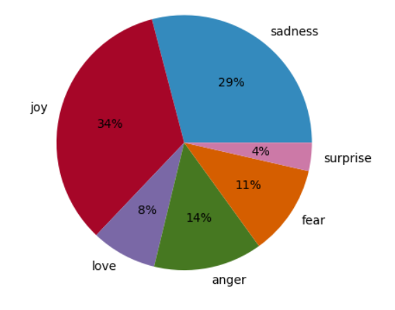

# sentiment-analysis
A deep learning project using bidirectional LSTMs to perform text sentiment analysis.

## Setup
To be able to execute the following notebooks and py files first create an environment using anaconda prompt  

                              
  <strong>conda create -n envname python=3.1</strong>

After you activate the environmets install the <strong>requirements.txt</strong> using the following command:

  <strong>pip install -r requirements.txt</strong>

After you train the model you can run the app by writing the command:

  <strong>streamlit run app.py</strong>

## Data
Every record in this dataset represents a text extracted from a tweet, paired with an associated tag that indicates the primary emotion expressed. The dataset categorizes emotions into six distinct groups: sadness (0), joy (1), love (2), anger (3), fear (4), and surprise (5). The following picture depicts the ratio of each class.

  

## Result
My deep neural network architecture achieved an accuracy of 93%. For more information about the model architecture check the <strong>model.ipynb</strong> file.

